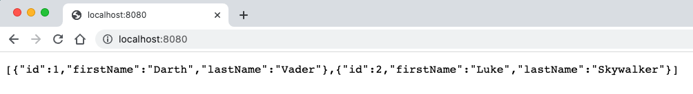
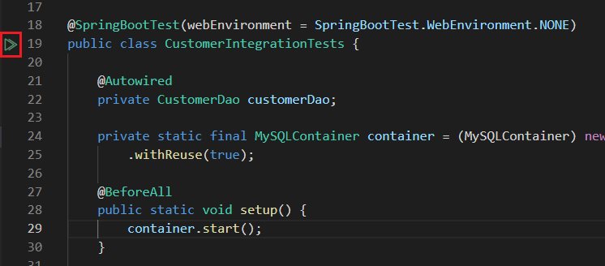
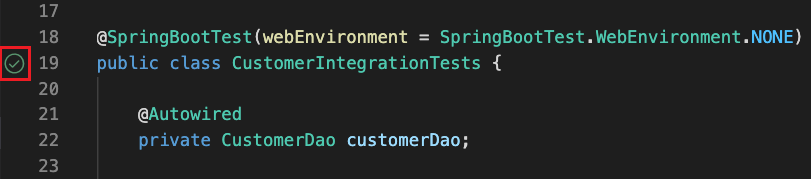

# Basic Testcontainers Demo

### Credits

The following lab is based on a [session](https://www.youtube.com/watch?v=v3eQCIWLYOw&t=2903s) presented by Marco Behler from JetBrains.


### Building and Running the Sample Application

Clone the repository:

```
$ git clone https://github.com/swseighman/Testcontainers-Demo.git
```

Change to the Testcontainers-Demo directory:

```
$ cd Testcontainers-Demo
```

Start the MySQL container:

```
$ docker-compose up
```

Build the application:

```
$ mvn package
```

Run the application:

```
$ java -jar target/testcontainers-demo-0.0.1-SNAPSHOT.jar
```

Browse to [http://localhost:8080](http://localhost:8080)



### Running Tests

If the MySQL container is still running, shutdown the container:

```
$ docker-compose down
```


To run the test(s) in VSCode, click on the play icon in the `CustomerIntegrationTest.java` file:



If the tests are successful, you see similar output:


To re-run the test, click on the circle checkmark:



To speed up the tests (by reducing the MySQL container startup time), you can configure the `<homedir>/.testcontainers.properties` file to reuse the current container by including the following line:

```
testcontainers.reuse.enable=true
```

Here's an example of the complete file:

```
#Modified by Testcontainers
#Mon Nov 01 13:12:01 EDT 2021
docker.client.strategy=org.testcontainers.dockerclient.UnixSocketClientProviderStrategy
testcontainers.reuse.enable=true
```


